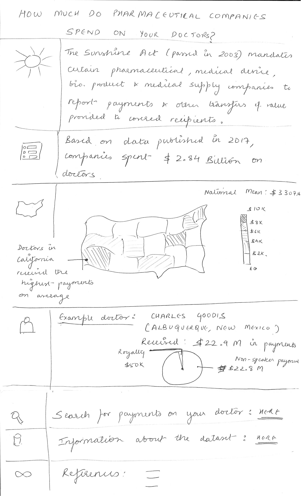

## Project Name: How much do pharma cos spend on your doctors?

(Part 1 is linked [here](./FinalProjectPart1.md).)

## Part 2
### Wireframe
#### Initial
My initial plan was to introduce the Sunshine Act to users, then provide a national picture, followed by a Pennsylvania wide view of spending. I decided to tweak that by replacing the Pennsylvania-wide picture with a representation of the spending on an actual doctor as follows:   

#### Refined before testing
I decided to refine this further by removing the introduction to the Sunshine Act to directly jump into the vast magnitude of payments being exchanged to evoke shock from the users and to provide the range of spendings of different doctors. This resulted in the following wireframe which I used for testing.

### Research Plan (including script)
Linked [here](./FinalProjectResearchPlan.md).

### Feedback
Raw user feedback is linked [here](./User_Feedback.pdf).

Consolidated the feedback provided as below:
* 3/5 users _couldn't understand why the information presented to them was valuable_. They understood the magnitude of spending involved, but _asked why they should care_. **Action item:** Introduce images of articles related to kickbacks (where doctors were influenced into prescribing specific drugs to patients) on the top. 
* 1 user was thrown off by the heading and thought that the intended audience was pharmaceutical companies who would track their competition. **Action item:** Not incorporating feedback
* 3/5 users found the information flow to be incoherent and suggested reordering the sections as: National figure -> National mean map -> Spend ranges on physicians -> Spending on a single doctor. **Action item:** Incorporate feedback
* 1 user didn't understand what to make out of the spend ranges, but liked the sentences (facts) about the payments. **Action item:** 
* 1 user was repeatedly thrown off by 'spend' and 'payments' being used interchangeably at different points. **Action item:** Change occurences of 'spend' to 'payments'
* 1 user pointed out a similar disrepancy with 'doctors' and 'physicians' usage. **Action item:** Change occurences of 'doctors' to 'physicians' to comply with CMS nomenclature as well. 
* 5/5 users wondered why a particular doctor was highlighted. 4/5 users assumed that the webpage will have a functionality to search for a particular physician, or for the payment range graph (visual #2) to drive the physician whose information is being displayed. **Action item:** TBD based on technical feasibility of implementing such a feature. 
* Suggestions around Mean Payments per State visual: **Action item:** Incorporate all of these
   1) Map should display all states including Hawaii (1/5)
   2) Can color scheme to a two-color gradient with green for mean values below the national mean and red for values above it (2/5)
   3) Provide more information on mouse-over on a particular state (2/5)
* 2/5 users didn't understand the y-axis for the payment range graph. **Action item:** 
