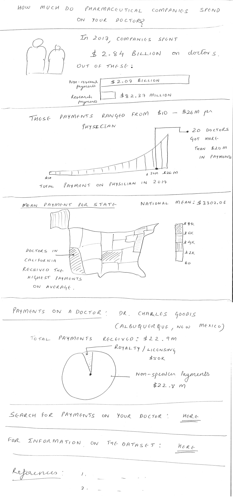

## Project Name: How much do pharma cos spend on your doctors?

(Part 1 is linked [here](./FinalProjectPart1.md).)

## Part 2
### Wireframe
#### Initial
My initial plan was to introduce the Sunshine Act to users, then provide a national picture, followed by a Pennsylvania wide view of spending. I decided to tweak that by replacing the Pennsylvania-wide picture with a representation of the spending on an actual doctor as follows:   

#### Refined before testing
I decided to refine this further by removing the introduction to the Sunshine Act to directly jump into the vast magnitude of payments being exchanged to evoke shock from the users and to provide the range of spendings of different doctors. This resulted in the following wireframe which I used for testing.

### Research Plan (including script)
Linked [here](./FinalProjectResearchPlan.md).

### Feedback

### Next steps
TBD.
