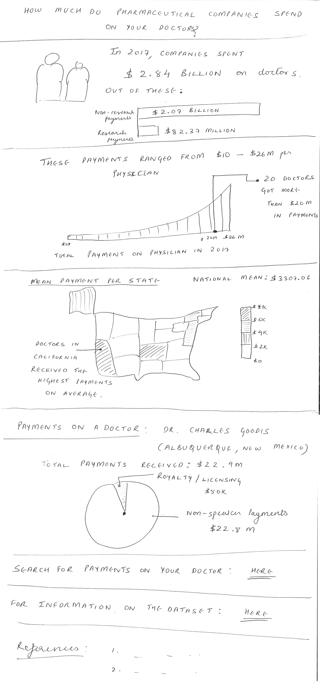

## Research Plan
### Goals / Questions
| Goals |	Questions |
| ------ | -------- |
| Evaluate web page |	Do people unfamiliar with CMS' reporting program understand what the page is about? |
| Evaluate participant's takeaways | Does the webpage generate interest/ curiosity to check information on their doctors? |
| Prioritize what to fix |	What problems are most severe? |

### Background
The Sunshine Act requires applicable manufacturers to report payments or transfers of value made on doctors or teaching hospitals. This project captures the volume of payments being made on doctors and analyses this information at various levels. 

### Target Audience for the project
College students (patients) availing US healthcare. Basic knowledge of navigating websites taken as given.

### Approach to identify participants

### Metrics
* Whether participants understand what the site is about
* Whether participants seem interested in the subject matter
* Whether participants seem interested in looking up their doctors' information/ explore the data

### Methods
* 10-15 min interviews people who are unfamiliar with NASA SBIR/STTR
* Notes
* Feedback on paper mockup
* In-person

### Script
Script for testing is enclosed [here](./ScriptForUserTesting.md).

### Test asset
The following printout was used to perform the test.

